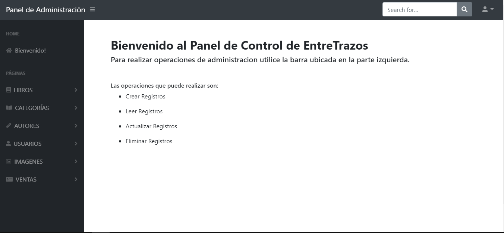
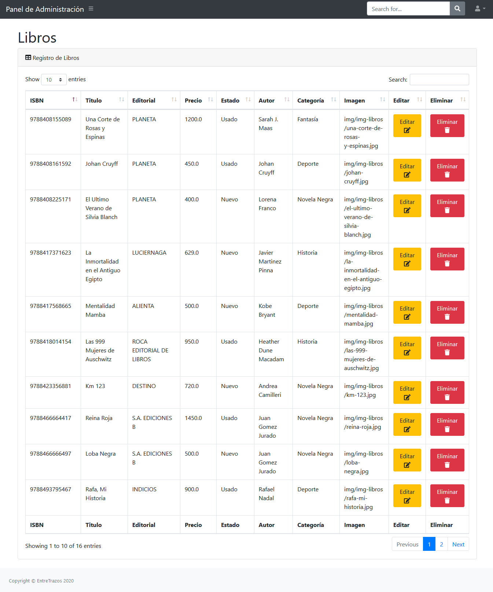

# EntreTrazos
"Backend-EntreTrazos" es una API-REST de administración de datos para un sistema de ventas de libros nuevos/usados al publico.  
El front-end para su consumo fue desarrollado utilizando:
* HTML
* CSS
* Bootstrap
* JavaScript  

Click en el link para probarla: https://entretrazos.now.sh 
### Panel de Administración

Cuenta con un panel de control que permite la lectura, creación, edición y eliminación de registros. Las tecnologías utilizadas para su desarrollo fueron:
* Spring Boot  
* Spring MVC 
* Spring Security
* Thymeleaf.




### Comunicación y uso de la API
Toda información devuelta por el servidor tendrá el formato **JSON**.  
Para utilizar la API puedes realizar distintos métodos de petición **HTTP**:  
```
GET, POST, PUT, DELETE
```
Todas las peticiones deben comenzar con :  
```
https://demo-entre-trazos.herokuapp.com/api/...
```
Por ejemplo puedes hacer una petición para ver un libro determinado de acuerdo a su ID :
```
https://demo-entre-trazos.herokuapp.com/api/libro/3
```
Respuesta: 
``` json
{
    "id": 3,
    "isbn": "9788417371623",
    "titulo": "La Inmortalidad en el Antiguo Egipto",
    "editorial": "LUCIERNAGA",
    "precio": 629.0,
    "estado": "Nuevo",
    "imagen": {
        "id": 3,
        "url": "img/img-libros/la-inmortalidad-en-el-antiguo-egipto.jpg"
    },
    "autor": {
        "id": 3,
        "nombre": "Javier Martinez Pinna"
    },
    "categoria": {
        "id": 3,
        "nombre": "Historia"
    }
}
```

|  | Petición |
| ------------- | ------------- |
| Mostrar lista de libros  | ```https://demo-entre-trazos.herokuapp.com/api/libro/```  |
| Mostrar lista de categorías  | ```https://demo-entre-trazos.herokuapp.com/api/categoria/```  |
| Mostrar ventas realizadas  | ```https://demo-entre-trazos.herokuapp.com/api/compra/```  |
